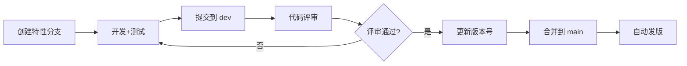

# 项目管理与发版规范

本文档定义了 zentao-workflow 项目的开发流程、版本管理和发版规范。

## 分支策略

### 分支说明

| 分支 | 用途 | 保护级别 |
|------|------|----------|
| `main` | 生产分支，存放稳定发布版本 | 高（受保护） |
| `dev` | 开发分支，日常开发迭代 | 中 |

### 分支规则

```
main (生产) ←── 合并 ─── dev (开发) ←── 特性分支
    │                        │
    │                        ├── feature/xxx
    │                        ├── fix/xxx
    │                        └── docs/xxx
    │
    └── 仅接受来自 dev 的 PR（经评审后合并）
```

## 开发流程

### 标准开发流程



### Step 1: 创建特性分支

```bash
git checkout dev
git pull origin dev
git checkout -b feature/你的功能名
```

分支命名规范：
- `feature/xxx` - 新功能
- `fix/xxx` - Bug 修复
- `docs/xxx` - 文档更新
- `refactor/xxx` - 代码重构

### Step 2: 开发与测试

开发完成后，确保：
- [ ] 代码已本地测试
- [ ] 遵循代码规范
- [ ] 更新相关文档

### Step 3: 提交代码

```bash
# 提交到 dev 分支
git add .
git commit -m "feat: 功能描述"
git push origin feature/xxx

# 创建 PR 到 dev 分支
```

### Step 4: 代码评审

- 所有合并到 dev 的代码需要评审
- 评审通过后合并到 dev

### Step 5: 合并到 main

当 dev 分支稳定后：
1. 更新版本号（见下方版本管理）
2. 更新 CHANGELOG.md
3. 创建 PR: dev → main
4. 合并后自动触发发版

## 版本管理

### 语义化版本 (SemVer)

版本号格式: `MAJOR.MINOR.PATCH` (如 `1.2.3`)

| 版本类型 | 何时递增 | 示例 |
|----------|----------|------|
| **MAJOR** | 不兼容的 API 变更 | 1.0.0 → 2.0.0 |
| **MINOR** | 新增功能，向后兼容 | 1.0.0 → 1.1.0 |
| **PATCH** | Bug 修复，向后兼容 | 1.0.0 → 1.0.1 |

### 版本文件

- `VERSION` - 存放当前版本号
- `CHANGELOG.md` - 变更记录

### 发版前检查清单

- [ ] VERSION 文件已更新
- [ ] CHANGELOG.md 已更新
- [ ] README.md 版本徽章已更新
- [ ] 所有测试通过
- [ ] 代码已评审

## 提交规范

### 提交消息格式

```
<type>(<scope>): <subject>

<body>

<footer>
```

### Type 类型

| Type | 说明 | 示例 |
|------|------|------|
| `feat` | 新功能 | feat: 添加批量下载功能 |
| `fix` | Bug 修复 | fix: 修复附件路径问题 |
| `docs` | 文档更新 | docs: 更新安装说明 |
| `style` | 代码格式 | style: 格式化代码 |
| `refactor` | 代码重构 | refactor: 优化配置加载 |
| `test` | 测试相关 | test: 添加单元测试 |
| `chore` | 构建/工具 | chore: 更新 GitHub Actions |
| `release` | 版本发布 | release: v1.1.0 |

### Scope（可选）

- `java` - Java 版本相关
- `python` - Python 版本相关
- `skill` - SKILL.md 相关
- `ci` - CI/CD 相关

## 文件管理规则

### 分支专属文件

| 文件 | dev 分支 | main 分支 | 说明 |
|------|----------|-----------|------|
| `CLAUDE.md` | ✅ | ❌ | 开发环境配置，不进入发布包 |
| `.release-ignore` | ✅ | ❌ | 打包排除配置 |
| `.github/` | ✅ | ✅ | CI/CD 配置 |
| `references/*.md` | ✅ | ✅ | 参考指南 |

### 发布包排除

以下文件**不包含**在 release zip 中：
- `CLAUDE.md` - 开发指南
- `.gitignore`
- `.release-ignore`
- IDE 配置文件
- Python 缓存

## 自动化发版

### 触发条件

- 代码合并到 `main` 分支
- 或推送 tag `v*`

### 发版流程

```yaml
1. 检出代码
2. 读取版本号
3. 打包文件 → zentao-workflow-vX.X.X.zip
4. 提取 CHANGELOG
5. 创建 GitHub Release
6. 上传 zip 文件
```

### Release 资源

每个版本包含：
- `zentao-workflow-vX.X.X.zip` - 完整安装包
- Release Notes - 变更说明和安装指南

## 紧急修复流程

### Hotfix 流程

```bash
# 1. 从 main 创建 hotfix 分支
git checkout main
git checkout -b hotfix/v1.0.1-fix-xxx

# 2. 修复并测试
# ...

# 3. 更新版本号（PATCH）
echo "1.0.1" > VERSION

# 4. 提交并合并到 main
git commit -m "fix: 紧急修复描述"
git push origin hotfix/v1.0.1-fix-xxx

# 5. 创建 PR 到 main
# 合并后自动发版

# 6. 同步到 dev
git checkout dev
git merge main
git push origin dev
```

## 检查命令

### 发版前检查

```bash
# 检查当前分支
git branch --show-current

# 检查未提交的更改
git status

# 检查版本号
cat VERSION

# 检查 CHANGELOG
head -20 CHANGELOG.md

# 检查与远程同步状态
git fetch origin
git status
```

### 分支同步检查

```bash
# 确保 dev 与 main 同步
git checkout main
git pull origin main
git checkout dev
git merge main
```

## 常见问题

### Q: 开发文件误提交到 main 怎么办？

```bash
# 回滚单个文件
git checkout main
git checkout origin/dev -- CLAUDE.md
git commit -m "chore: 移除开发文件"
git push origin main
```

### Q: 版本号忘记更新怎么办？

如果在合并到 main 后发现版本号未更新：
1. 在 dev 分支更新版本号
2. 再次创建 PR 合并到 main
3. 手动删除错误的 release（如有）

### Q: 如何查看两个版本的差异？

```bash
git log v1.0.0..v1.1.0 --oneline
git diff v1.0.0..v1.1.0 --stat
```
